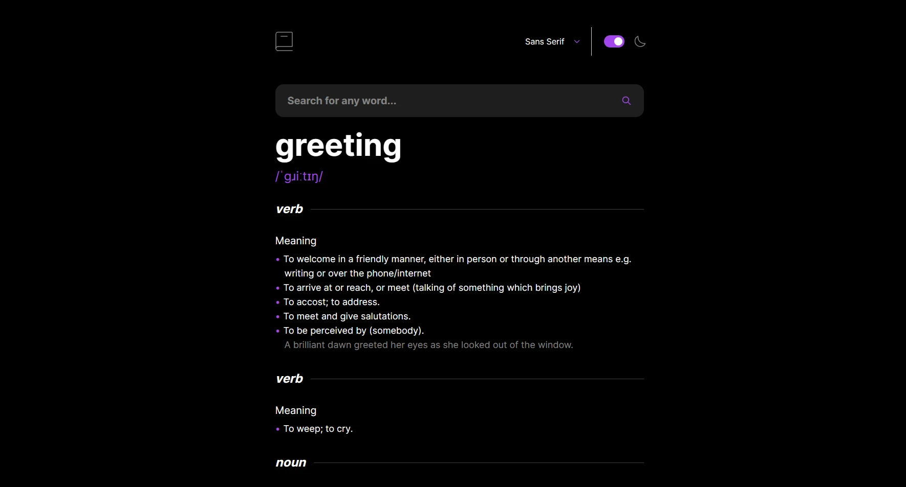
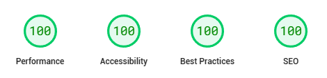

# dictionary-web-app

"dictionary-web-app" is a [Frontend Mentor challenge](https://www.frontendmentor.io/challenges/dictionary-web-app-h5wwnyuKFL) that integrates Dictionary API to create a real-world dictionary web app.

## Links

- [Live on Vercel](https://dictionary-web-app-firdausthedev.vercel.app/)

## Features

- Search for words using the input field
- See the Free Dictionary API's response for the searched word
- Play the audio file for a word when it's available
- Switch between serif, sans serif, and monospace fonts
- Switch between light and dark themes
- View the optimal layout for the interface depending on their device's screen size
- See hover and focus states for all interactive elements on the page

## Screenshot

## PageSpeed Performance Insight

